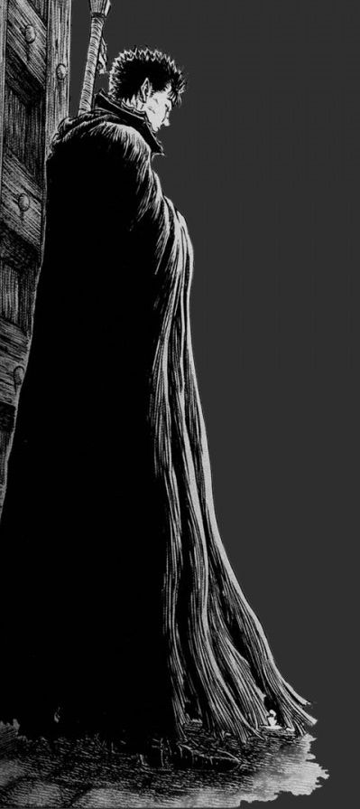

<table>
  <tr>
    <td style="width: 50%;">
       
    </td>
    <td style="width: 50%; vertical-align: top;">
      

        Kauan Meiguins

    /About_Me
    │
    ├── /bio
    │   ├── he/him - brazilian - (pt/br + english)
    │   ├── /backend developer
    │   │   └── at https://web.dio.me/
    │   ├── /systems analysis and development
    │   │   └── at https://estacio.br/
    │   └── /Backend and mobile developer
    │
    ├── /os
    │   ├── /linux
    │   │   └── arch_linux (main)
    │   └── /windows
    │       └── Windows 11
    │
    ├── /languages
    │   ├── Java.java
    │   ├── Kotlin.kt
    │   └── python.py
    │
    └── /learning
        ├── Kotlin
        ├── Spring
        ├── Docker
        └── SQL/NoSQL
        
  </tr>
</table>
